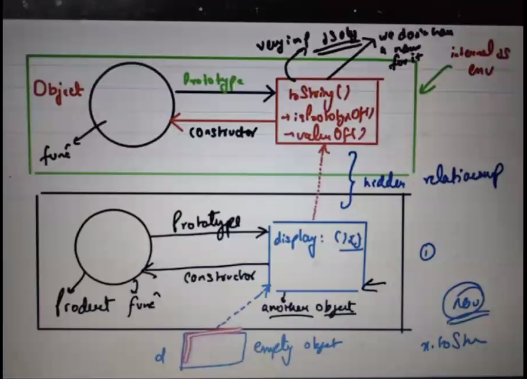
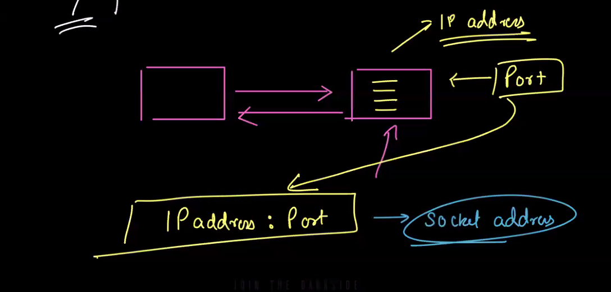
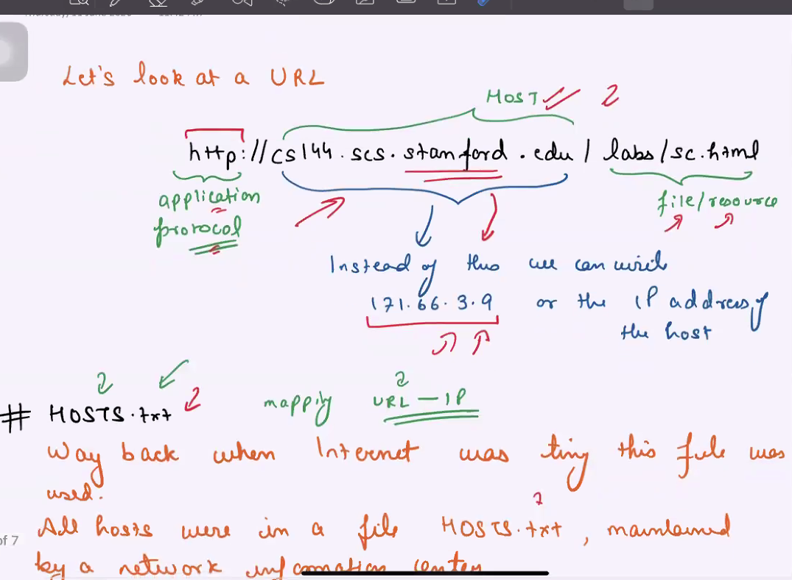
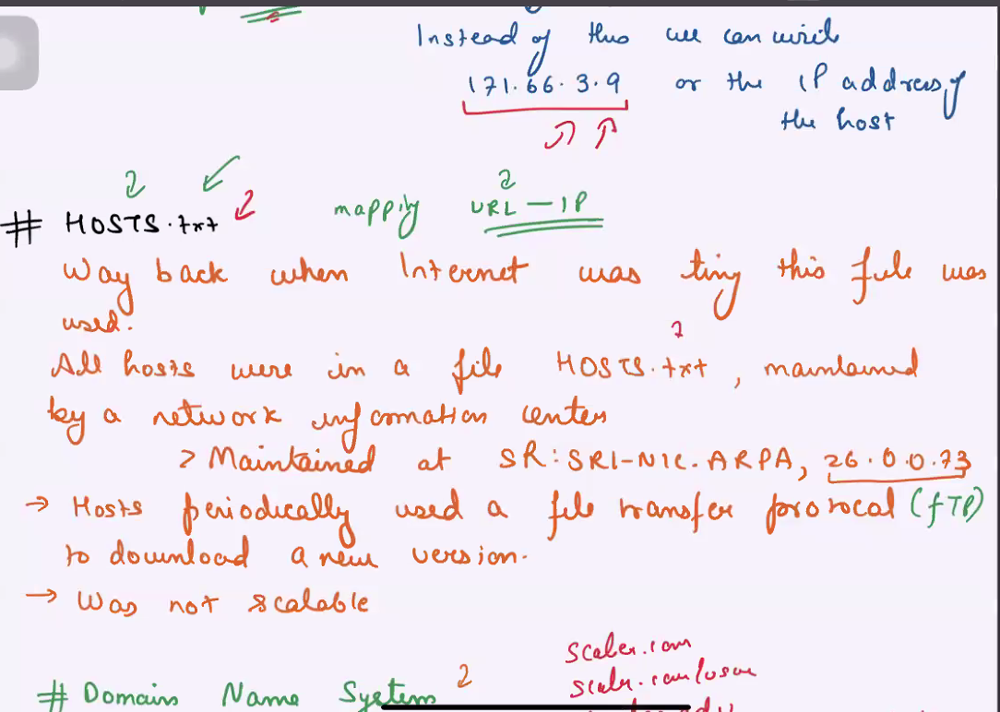
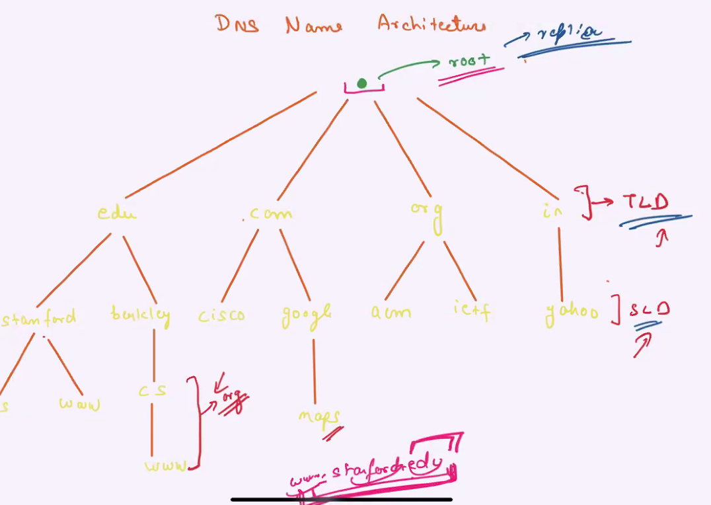

case study : delicious bookmarking app








command for dns lookup (CLI)

```
dig google.com
```

Read about:

1. What is "A" record in DNS?
2. What is CNAME in DNS?

Stack overflow vertical scaling case study
link: http://highscalability.com/blog/2009/8/5/stack-overflow-architecture.html
https://nickcraver.com/blog/2016/02/17/stack-overflow-the-architecture-2016-edition/

https://blog.serverfault.com/2015/03/05/how-we-upgrade-a-live-data-center/

Pinterest: http://highscalability.com/blog/2013/4/15/scaling-pinterest-from-0-to-10s-of-billions-of-page-views-a.html

hotstar: https://www.youtube.com/watch?v=QjvyiyH4rr0
