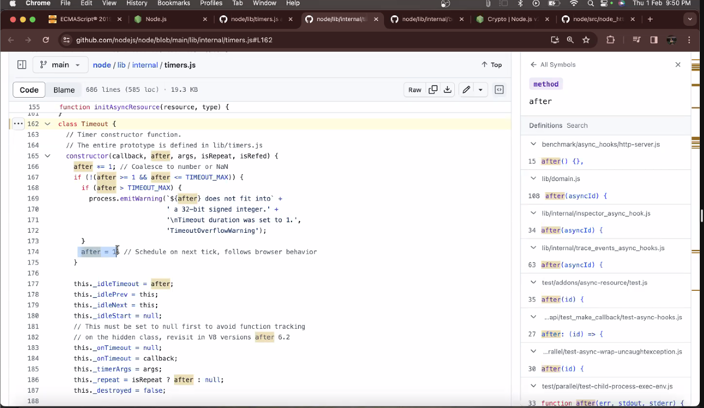

- Node js Runtime github: https://github.com/nodejs/node
- 
- 
- 
- 
- 
- 
- 
- 
- 
- 
- 
- 
- 
- 
- 
-
- Orinoco garbage collector: https://v8.dev/blog/orinoco-parallel-scavenger

#### Compilation V8:

-Ignition: https://docs.google.com/presentation/d/1chhN90uB8yPaIhx_h2M3lPyxPgdPmkADqSNAoXYQiVE/edit#slide=id.g18d89eb289_1_336

https://www.youtube.com/watch?v=r5OWCtuKiAk&feature=youtu.be

