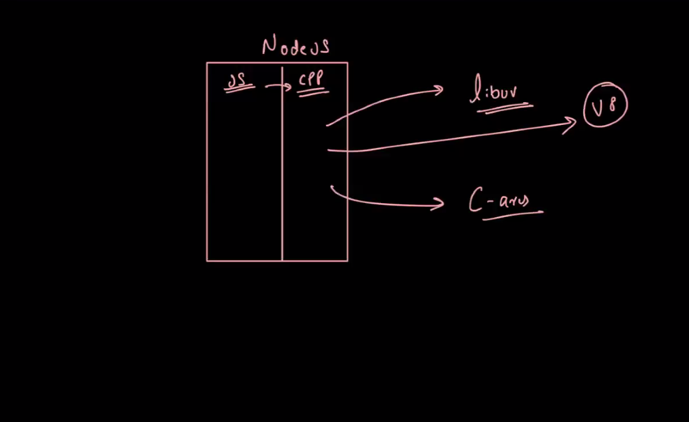

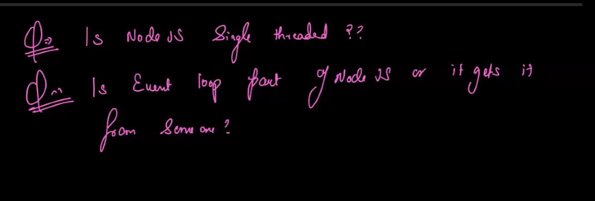

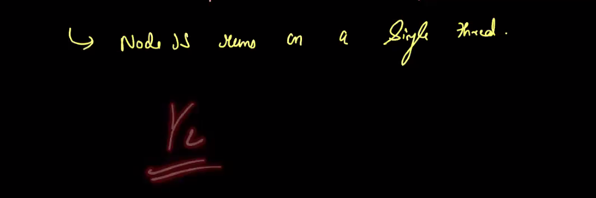

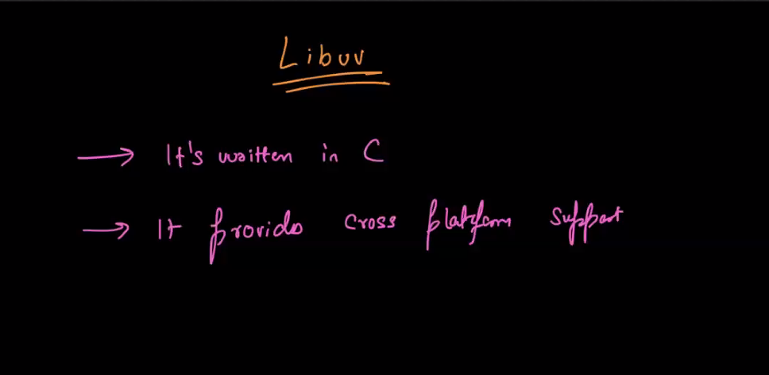

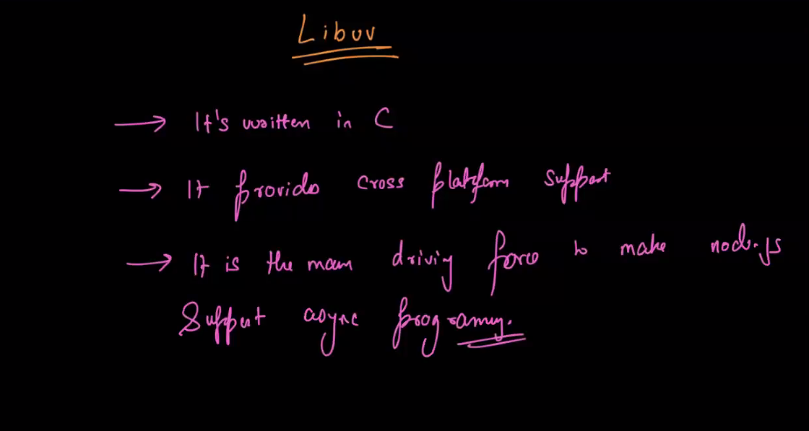

event loop implementation in libuv: https://github.com/libuv/libuv/blob/v1.x/src/unix/core.c#L415

https://docs.libuv.org/en/v1.x/loop.html

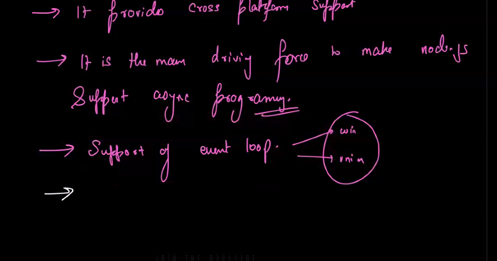

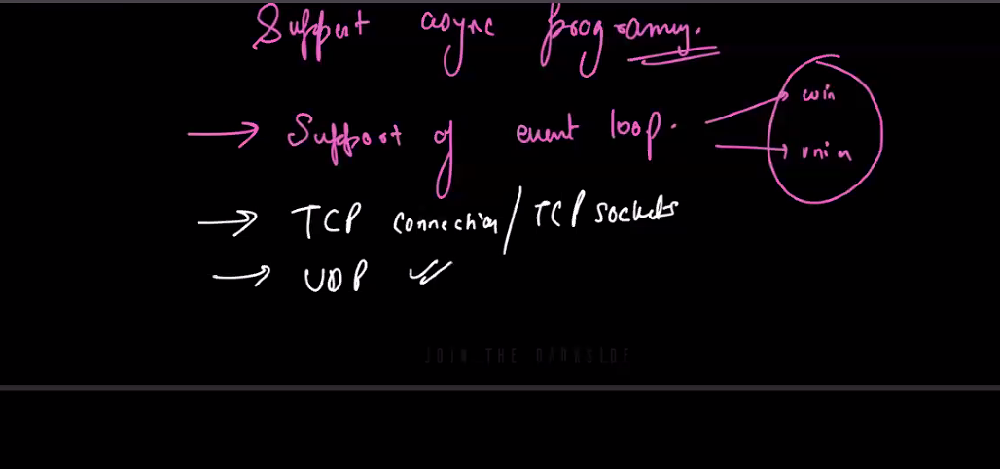

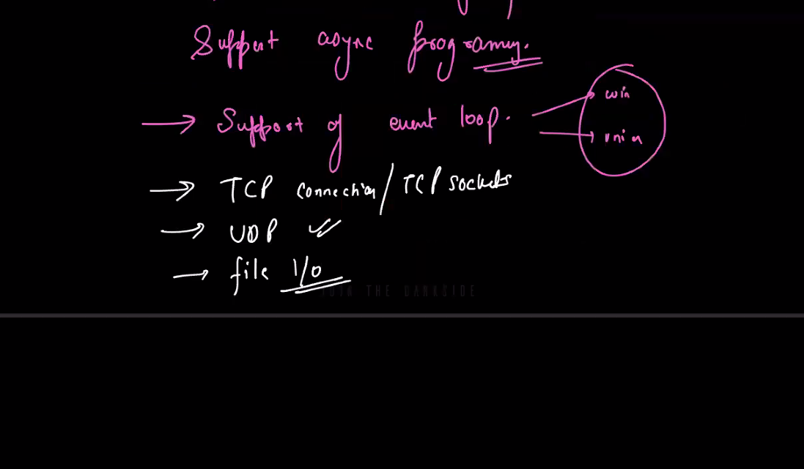

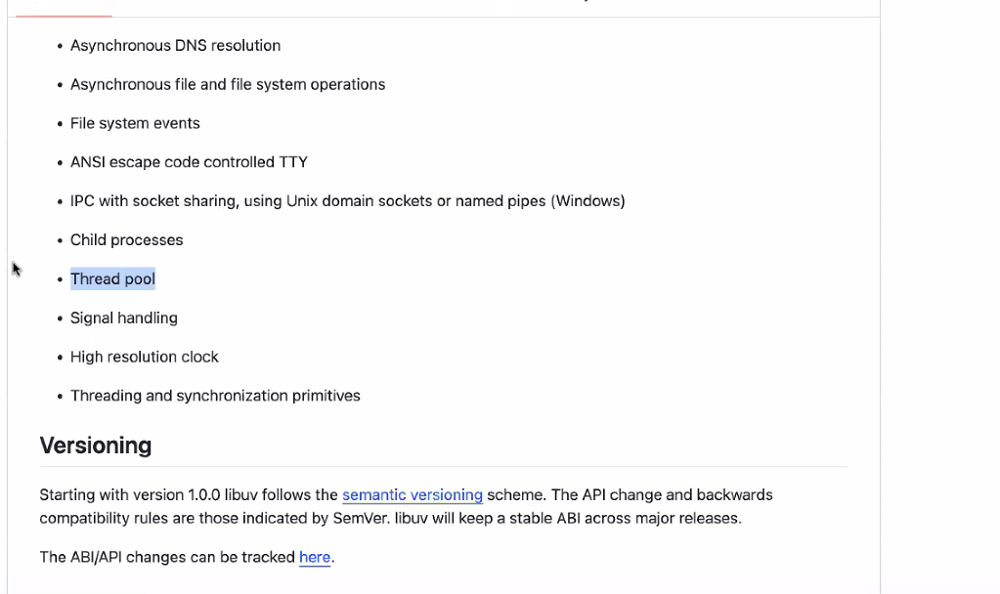

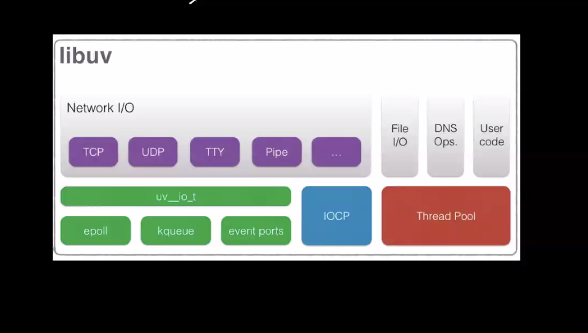

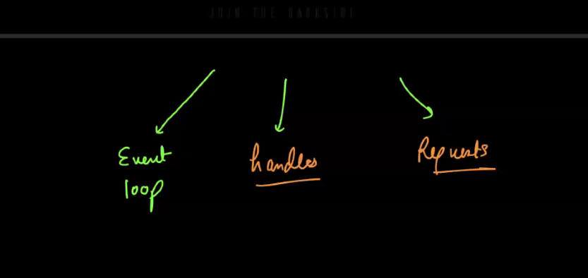

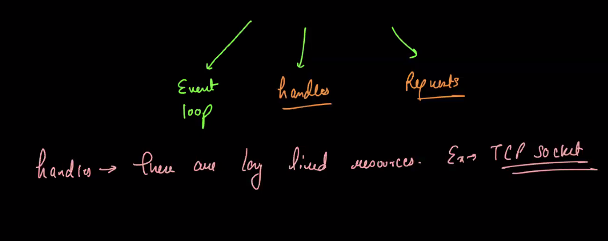

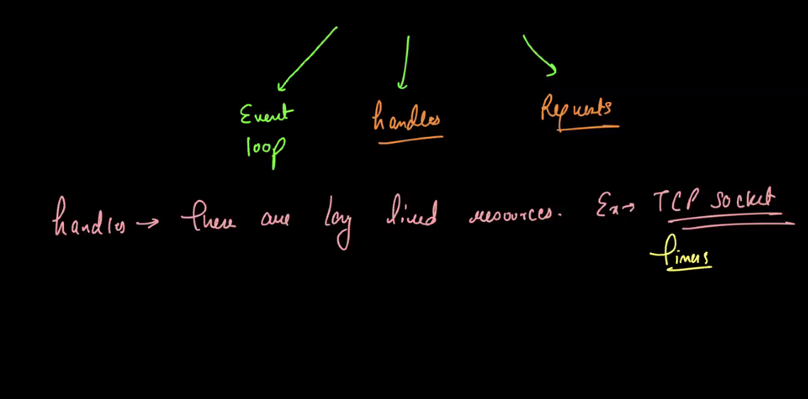

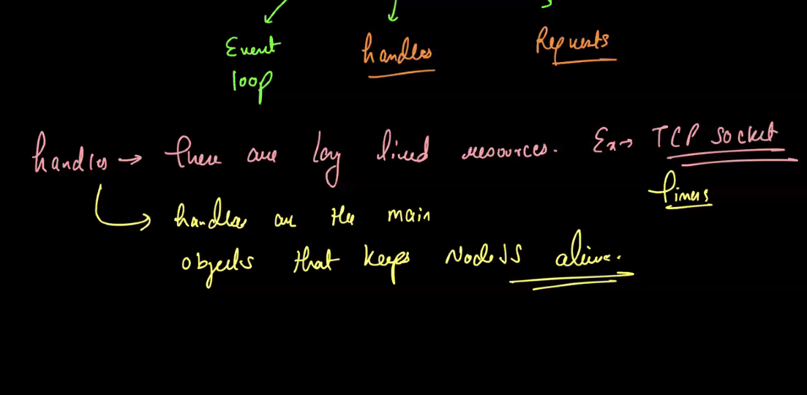

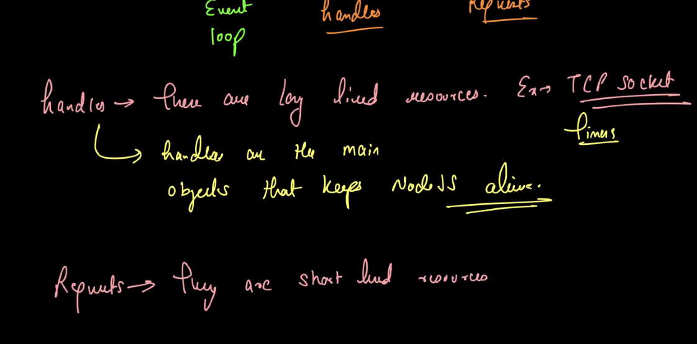

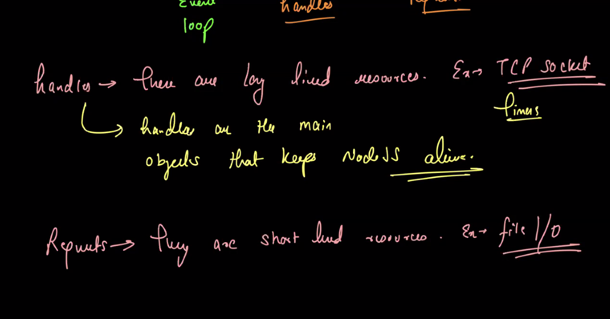

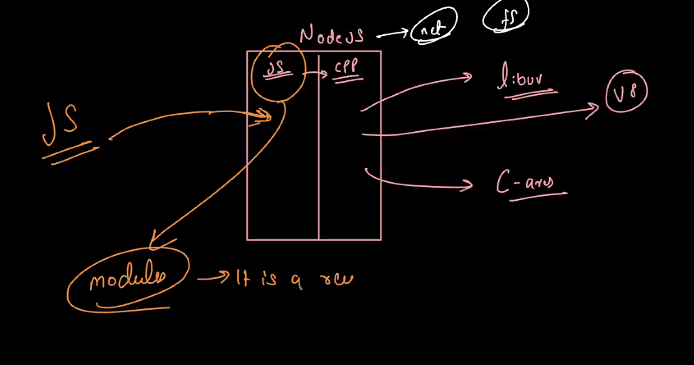

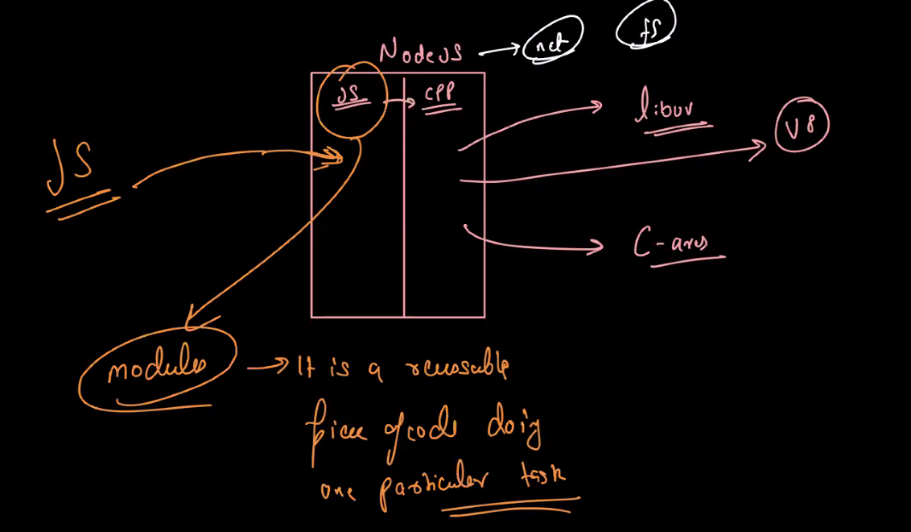

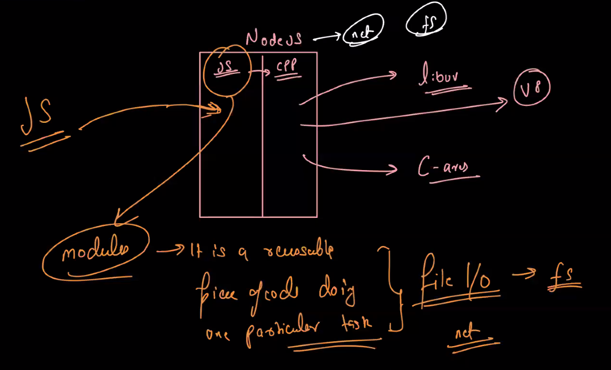

Node js internal: https://medium.com/softup-technologies/node-js-internals-not-everything-happens-on-the-thread-pool-a14d0a286efb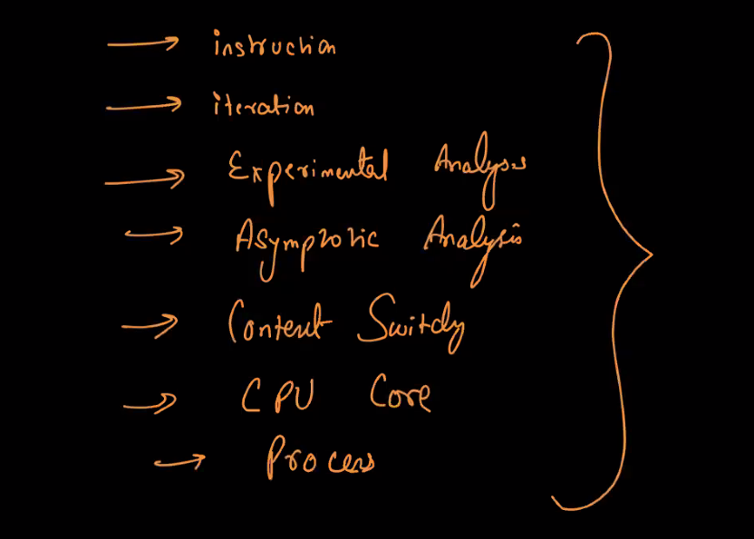
