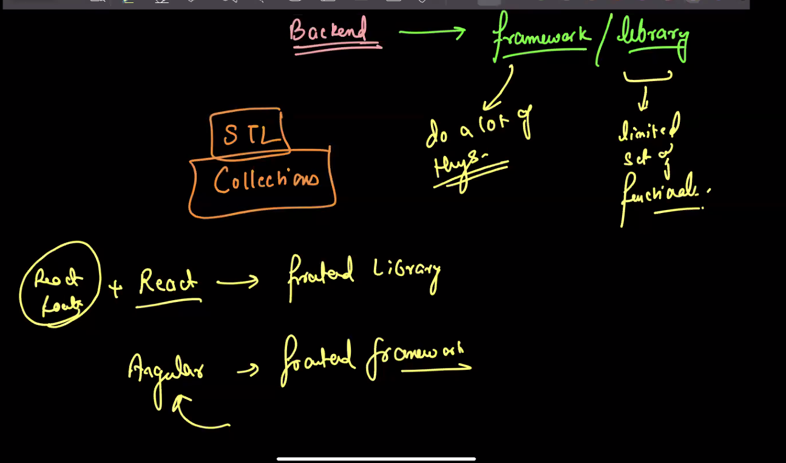

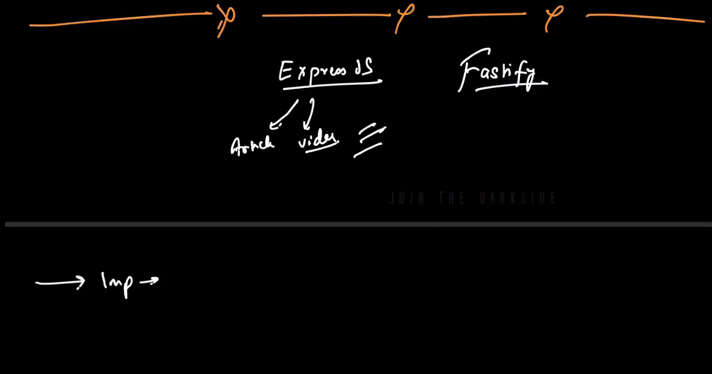

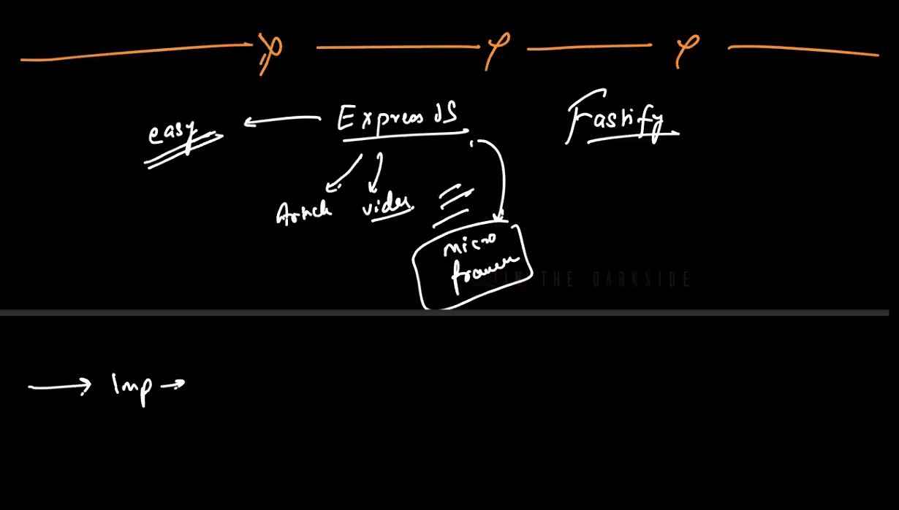

- load testing : k6, bombardier, jmeter,locust,autocanon
- Express vs Spring boot Medium article

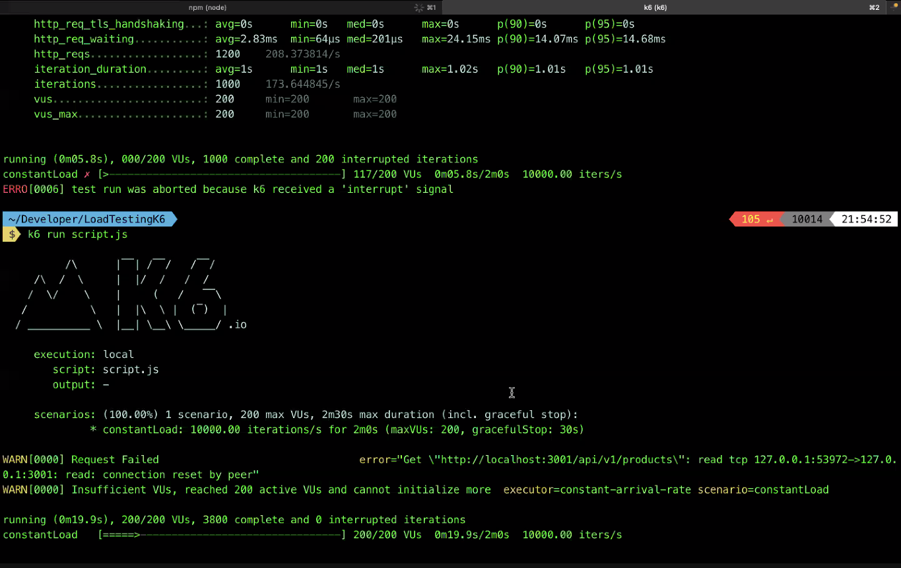

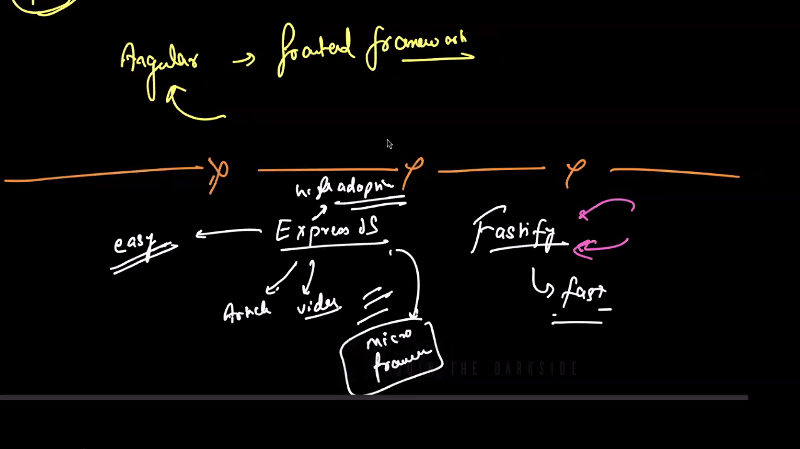

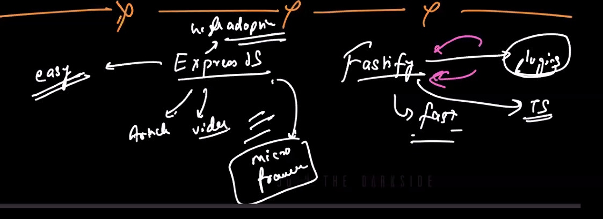

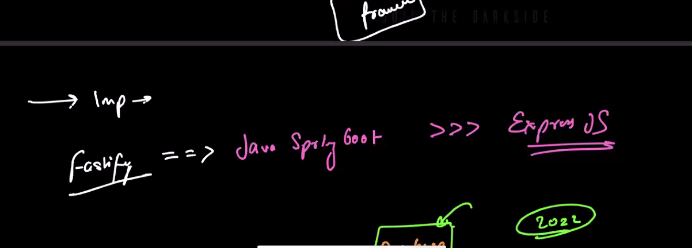

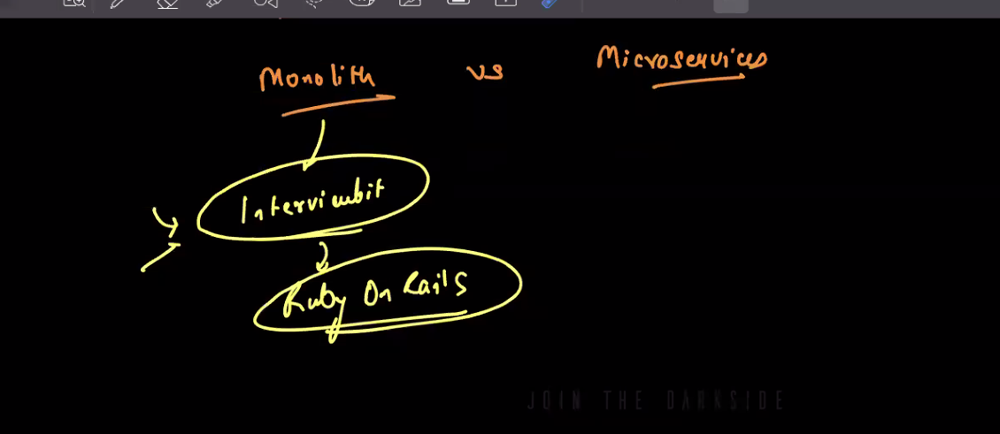

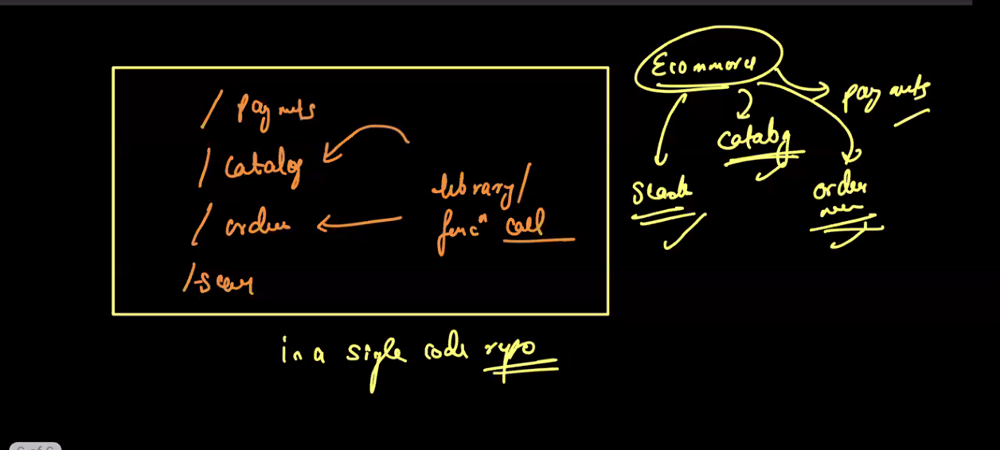

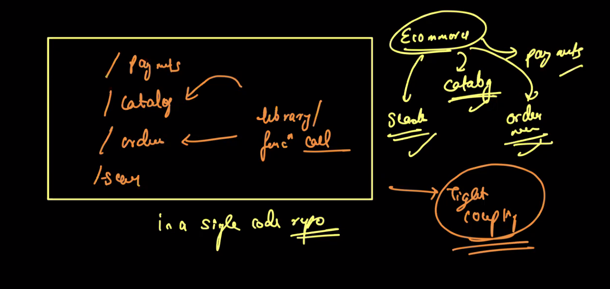

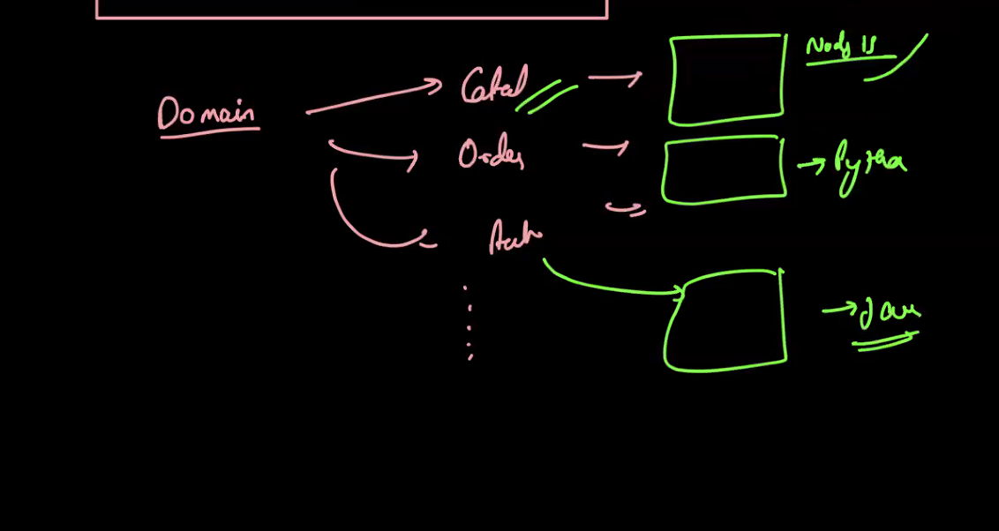

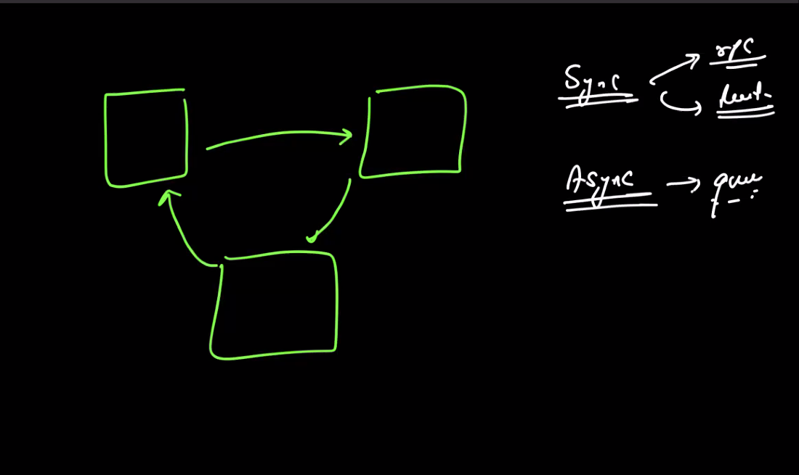

Monolith vs microservices: https://medium.com/design-microservices-architecture-with-patterns/architecture-comparison-monolithic-vs-microservices-4109265c4806

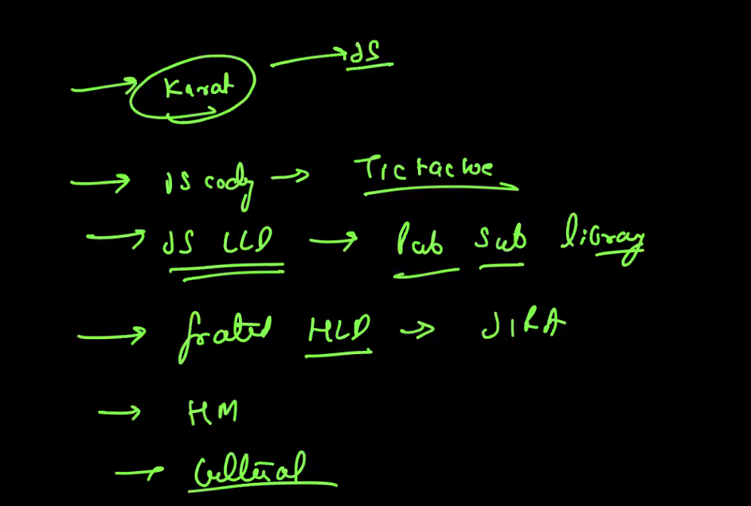
