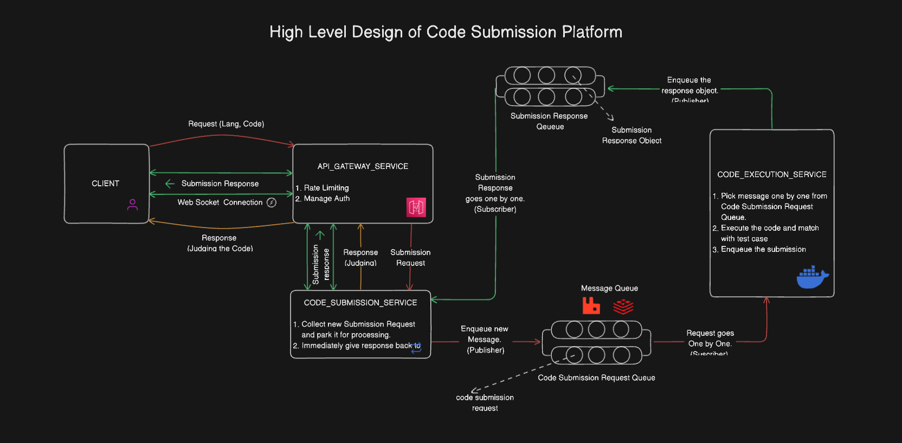

### Backend Infra of codeforces/leetcode/hacker rank

- Basic crud
- Web sockets
- Async comm -> microservices -> msg queue
- Code
- Mysql, MongoDB
- Containerization

- fork bomb
- scalibility
- When you submit the code
  - code is collected
  - code is compiled
  - code ran for multiple test cases
  - output of  code is matched with iutput testcases

- Storage infra is complex
  - How to store problem statement
  - How to store input and ouput test cases

- Client (Web apps)

#### Flows
1. Main entities of the app
- User
   - Admin (CRUD on problems, see submissions of all users)
   - Normal User (Submit code and see the response of the problem, can see old submission of their own)

2. How code Submission will work?

- From client side (req{lang,code}) -> Micreoservice 1 (API Gateway)

- Microservice 1 - Api Gateway 
  - Rate limiting (5 req per min from aprticular API)
  - Manage Auth
  - Redirection

- Microservice 2 - Code submission service
  - code submission service 
  - collect new submission request and park it for processing (using message queue (pull based consumer)) - code submission queue
  - Api gateway will submit submission req -> code service submission queue will enqueue in code submission messaging queue and send response back to client that code execution is in progress-> executer service will pull/pick messages from queue which has submission details -> enqueue the submission response after execution in another queue (submission response queue)
  - code submission service will pull / pick the submission response from submission response queue

- Microservice 3 - Code executor service
    - pull the code submission from message queue
    - executer service will pull/pick messages from queue which has submission details
    - it will have configurable time limit for each language, we will kill the docker container if it excedded the tle
    - it will create new docker container for every new submission with required language to save from fork bomb
    - it will execute the code 
    - match alll the output with test cases
    - enqueue the submission response in another queue (submission response queue)

submision response queue -> Microservice 2 - code submission service

- Web socket for submitiing the qns and getting response by duplex persistent connection
- Web socket connection between client and server

- For premium user we can use priority queue for code submission queue

3. How Output matching works?
- string matching algorithm

